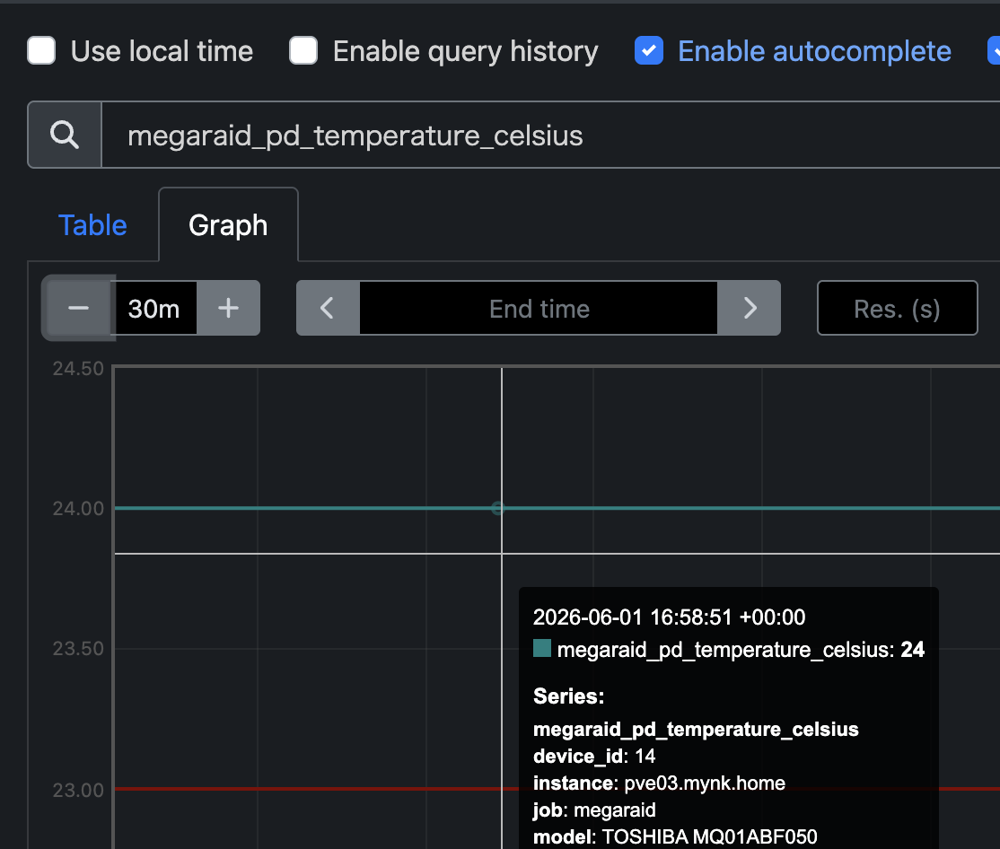
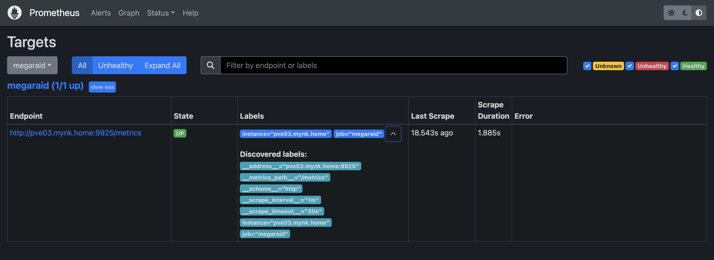
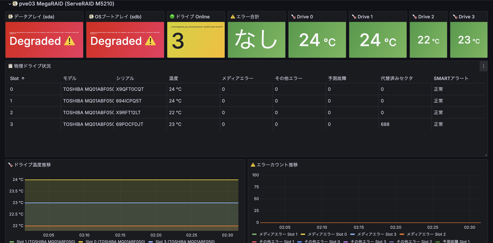

# megaraid-exporter

`megaraid-exporter` は、MegaRAID 系 RAID コントローラの状態を
Prometheus で監視するための、小さな Python 製 exporter です。

物理ドライブの Online / Offline 状態、温度、MegaCLI が返すエラー回数、
`smartctl` 経由で取得できる SMART 属性、仮想ドライブの劣化状態、
`/proc/diskstats` から取る読み書き量をまとめて `/metrics` として公開します。

## MegaRAID とは

MegaRAID は Broadcom / LSI 系の RAID コントローラ製品群です。
OS からは複数ディスクが 1 台または複数台の「仮想ドライブ」に見える一方、
実際の物理ドライブごとの状態確認には、コントローラ専用ツールや
パススルー経由の SMART 取得が必要になることがあります。

この exporter は、その「OS からは見えにくい物理ディスクの状態」を
Prometheus から観測しやすくすることを目的にしています。

## 検証環境

この実装は、次の環境で動作確認しています。

- ホスト OS: Proxmox VE 8.4.0
- カーネル: `6.8.12-9-pve`
- RAID コントローラ: Lenovo ServeRAID M5210
- 物理ドライブ: TOSHIBA `MQ01ABF050` x 4 台

特に、物理ドライブの SMART 属性は
`smartctl -d megaraid,N /dev/bus/0` が使える構成を前提としています。

## 互換性について

この exporter は Lenovo ServeRAID M5210 で検証していますが、
本質的には `megacli` と `smartctl -d megaraid,N /dev/bus/0` が使える
MegaRAID 系コントローラを対象にしています。

そのため、Dell PERC や他社の再ブランド品でも、
内部的に MegaRAID 互換で同じ取得方法が通るなら動く可能性があります。
ただし、現時点ではその互換性までは検証していません。

言い換えると、「そのまま動くかもしれないが、少なくともこの README が保証しているのは
M5210 上での動作まで」です。

## 動作確認したソフトウェア

- Python: `3.11.2`
- smartmontools / `smartctl`: `7.3`
- MegaCLI: `8.07.14`

`megacli` の配置は `/usr/sbin/megacli` を前提にしています。

## 依存パッケージ

外部の Python パッケージは使っていません。
利用しているのは Python 標準ライブラリのみです。

- `http.server`
- `subprocess`
- `re`

実行に必要なコマンドは次の 2 つです。

- `megacli`
- `smartctl`

## 取得する情報

この exporter は大きく 3 種類の情報を集めます。

1. MegaCLI から取得する物理ドライブ状態
2. `smartctl -d megaraid,N /dev/bus/0` から取得する SMART 属性
3. `/proc/diskstats` から取得する仮想ドライブの I/O バイト数

## SMART 属性とは

SMART は、ディスクが自分の健康状態を自己診断して記録するための仕組みです。
たとえば「代替済みセクタが増えていないか」「読めないセクタが出ていないか」
「どのくらい長時間使われているか」といった情報を持っています。

この exporter では、障害予兆として見やすい次の属性を使っています。

SMART 属性の対応は次の通りです。

- `5`: Reallocated Sector Count
- `9`: Power-On Hours
- `197`: Current Pending Sector
- `198`: Offline Uncorrectable

## 導入手順

以下は、検証環境に近い Proxmox VE / Debian 12 系ホストへ導入する例です。

### 1. 前提パッケージを入れる

`smartctl` は通常のパッケージで導入できます。

```bash
apt update
apt install -y smartmontools python3
```

`megacli` は標準 Debian リポジトリにないことがあるため、
検証環境では `hwraid.le-vert.net` のパッケージを使っています。

```bash
printf '%s\n' 'deb http://hwraid.le-vert.net/debian bookworm main' \
  > /etc/apt/sources.list.d/hwraid.list
apt update
apt install -y megacli
```

補足:
このリポジトリを使う場合は、環境によって配布元の公開鍵設定が必要になることがあります。
鍵の導入方法は配布元の案内に従ってください。

### 2. コマンドが使えることを確認する

```bash
megacli -v
smartctl --version
smartctl --scan
```

`smartctl --scan` の結果に
`/dev/bus/0 -d megaraid,N`
のような行が出ていれば、SMART パススルー取得の前提は揃っています。

### 3. exporter を配置する

```bash
install -m 755 megaraid_exporter.py /opt/megaraid_exporter.py
```

### 4. systemd unit を配置する

```bash
install -m 644 examples/megaraid-exporter.service \
  /etc/systemd/system/megaraid-exporter.service
systemctl daemon-reload
systemctl enable --now megaraid-exporter.service
```

### 5. 動作確認する

```bash
curl http://127.0.0.1:9925/metrics
systemctl status megaraid-exporter.service
```

Prometheus からは `http://<host>:9925/metrics` を scrape 対象に追加してください。

## Prometheus での確認例

### ターゲット登録状態

`pve03.mynk.home:9925` を `megaraid` ジョブとして登録し、
Prometheus から正常に scrape できている例です。



### 温度メトリクスの例

`megaraid_pd_temperature_celsius` を Prometheus の Expression Browser で
確認した例です。`instance`、`slot`、`device_id` などのラベル付きで
温度メトリクスを取得できていることが分かります。



## Grafana での確認例

この exporter で取得したメトリクスは、Grafana 上で
「物理ドライブ温度」「エラー回数」「Online / Offline 状態」
「代替済みセクタ数」「仮想ドライブの劣化状態」
「RAID がどの物理ドライブで構成されているか」などをまとめて可視化できます。

MegaRAID パネル群の例は、統合ダッシュボードから切り出した
テンプレート JSON を参照してください。

- [grafana_template/megaraid_panels.json](./grafana_template/megaraid_panels.json)

この JSON には、検証環境で実際に使っている
MegaRAID 用の row / stat / table / timeseries / bargauge パネル群だけを
抜き出してあります。

特に `🧩 RAID構成 / ディスク配分` テーブルでは、
各仮想ドライブがどの Slot / Span / Arm に乗っているかを確認できます。

Grafana のスクリーンショットを repo に追加する場合は、
たとえば次のパスに置く想定です。

- `docs/images/grafana-dashboard.png`



（ちなみにdegratedになってるのは、不良セクタが発生した disk3 を切り離して不完全な状態になっているため）

## メトリクス一覧

### 物理ドライブ

- `megaraid_pd_info`
  - 物理ドライブ情報。`slot`、`device_id`、`serial`、`model`、`firmware_state` に加えて、`state`、`size`、`speed`、`diskgroup`、`span`、`arm` をラベルに持つ info 用 gauge
- `megaraid_pd_online`
  - 物理ドライブがオンラインなら `1`、オフラインなら `0`
- `megaraid_pd_temperature_celsius`
  - 物理ドライブ温度
- `megaraid_pd_media_errors_total`
  - 物理ドライブのメディアエラー回数
- `megaraid_pd_other_errors_total`
  - 物理ドライブのその他エラー回数
- `megaraid_pd_predictive_failures_total`
  - 物理ドライブの予測故障回数
- `megaraid_pd_smart_alert`
  - メディアエラーまたは予測故障があれば `1`
- `megaraid_pd_reallocated_sectors`
  - SMART 属性 5。代替済みセクタ数
- `megaraid_pd_pending_sectors`
  - SMART 属性 197。保留中セクタ数
- `megaraid_pd_uncorrectable_sectors`
  - SMART 属性 198。回復不能セクタ数
- `megaraid_pd_power_on_hours`
  - SMART 属性 9。通電時間

### 仮想ドライブ

- `megaraid_vd_optimal`
  - 仮想ドライブが `Optimal` なら `1`、それ以外なら `0`
- `megaraid_vd_info`
  - 仮想ドライブ情報。`name`、`target_id`、`raid_level`、`state`、`size`、`drives_per_span`、`span_depth`、`number_of_spans` をラベルに持つ info 用 gauge
- `megaraid_vd_member_info`
  - 仮想ドライブを構成している物理ドライブの対応表。`仮想ドライブ -> DiskGroup / Span / Arm / Slot` の関係をラベルとして持つ info 用 gauge
- `megaraid_vd_read_bytes_total`
  - 仮想ドライブの累積読み込みバイト数
- `megaraid_vd_write_bytes_total`
  - 仮想ドライブの累積書き込みバイト数

## 実行方法

```bash
python3 megaraid_exporter.py
```

デフォルトでは `0.0.0.0:9925` で待ち受け、`/metrics` を公開します。

## systemd

簡単な unit file の例を同梱しています。

- [examples/megaraid-exporter.service](./examples/megaraid-exporter.service)

## 実装上の前提

- 仮想ドライブの I/O バイト数は `/proc/diskstats` を読みます
- `VD_TO_BLOCKDEV` は、現在の検証環境では `0 -> sda`, `1 -> sdb` を前提にしています
- 物理ドライブと `smartctl -d megaraid,N` の対応付けには、MegaCLI の `Device Id` を使っています

環境によっては、仮想ドライブと block device の対応付け部分は
調整が必要になるかもしれません。

## ライセンス

MIT License です。
詳細は [LICENSE](./LICENSE) を参照してください。
